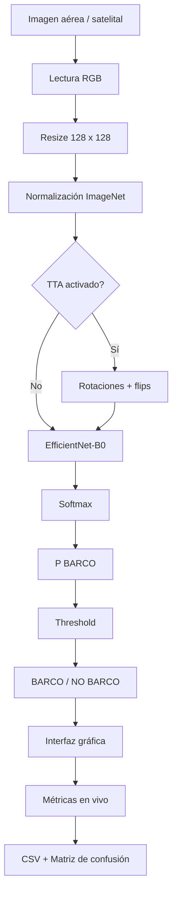

#  Clasificación de imágenes aéreas para detección de barcos

Sistema de visión artificial para la **clasificación binaria BARCO / NO BARCO** en imágenes aéreas y satelitales, desarrollado para un escenario de inspección y monitoreo portuario mediante un **UAV (drone)**.

El proyecto parte de imágenes tipo **ShipsNet** y evoluciona desde modelos clásicos basados en descriptores visuales hasta una red convolucional **EfficientNet-B0**, incorporando validación cruzada por escena, adaptación de dominio, Test-Time Augmentation (TTA) y una interfaz gráfica para evaluación en vivo.

---

##  Objetivo

Diseñar e implementar un clasificador capaz de determinar si una imagen aérea contiene o no una embarcación, con énfasis en:

- clasificación binaria **BARCO / NO BARCO**;
- imágenes aéreas/satelitales originalmente de **80 × 80 px RGB**;
- preprocesamiento y extracción de características;
- comparación de diferentes enfoques de Machine Learning y Deep Learning;
- validación cruzada;
- control de fuga de información mediante `scene_id`;
- evaluación sobre imágenes externas;
- inferencia en tiempo real;
- interfaz gráfica para la prueba en vivo;
- generación de métricas y matrices de confusión.

---

##  Modelo final

El clasificador final utiliza:

- **Arquitectura:** EfficientNet-B0
- **Framework:** PyTorch / Torchvision
- **Entrada del modelo:** 128 × 128 RGB
- **Clases:**
  - `0` → NO BARCO
  - `1` → BARCO
- **Normalización:** ImageNet
- **Fine-tuning:** 20 épocas
- **Learning rate de cabeza:** `1e-3`
- **Learning rate de fine-tuning:** `1e-4`
- **Weight decay:** `1e-4`
- **Label smoothing:** `0.05`
- **Semilla:** `42`

El modelo desplegado se encuentra en:

```text
models/ship_classifier_final.pt
```

y su configuración en:

```text
models/ship_classifier_final_config.json
```

---

## 📊 Resultados principales

### Validación 5-fold por escena — ShipsNet

Se utilizó **StratifiedGroupKFold con agrupación por `scene_id`** para reducir el riesgo de que imágenes provenientes de una misma escena aparecieran simultáneamente en entrenamiento y validación.

| Métrica | Resultado |
|---|---:|
| Accuracy promedio 5-fold | **99.75 %** |
| Desviación estándar | **0.125 %** |
| Precision OOF | **99.01 %** |
| Recall OOF | **100.00 %** |
| F1 OOF | **99.50 %** |
| Balanced Accuracy OOF | **99.83 %** |
| ROC-AUC OOF | **99.995 %** |

Matriz de confusión OOF global:

```text
                 Predicción
              NO BARCO   BARCO
Real NO BARCO    2990      10
Real BARCO          0    1000
```

### Validación externa

La evaluación en un dominio externo evidenció una disminución de desempeño respecto a ShipsNet, lo cual permitió estudiar el **domain shift** entre conjuntos de imágenes.

El valor consolidado almacenado para **EfficientNet-B0 + TTA** es:

```text
Accuracy externa con TTA: 96.25 %
```

Esta diferencia entre validación interna y externa es una parte importante del análisis del proyecto y evita interpretar la validación interna como una garantía de rendimiento sobre cualquier dominio.

---

##  Evolución metodológica

El proyecto no se limitó a entrenar una sola arquitectura. Se desarrolló una secuencia de experimentos para justificar la selección final:

```text
Baseline
   │
   ├── RGB / modelos clásicos
   │
   ├── HOG
   │
   ├── HSV
   │
   ├── HOG + HSV
   │
   ├── HOG + HSV + CLAHE
   │
   └── SVM + Grid Search
   │
   ▼
Adaptación de dominio
   │
   ▼
MobileNetV3-Small
   │
   ▼
EfficientNet-B0
   │
   ├── Fine-tuning
   ├── 5-fold por scene_id
   └── Test-Time Augmentation
   │
   ▼
Modelo final + interfaz gráfica
```

Los resultados de cada etapa se conservan en la carpeta `results/`.

---

##  Interfaz gráfica

La aplicación principal está implementada con **CustomTkinter**:

```text
app.py
```

Permite:

-  cargar una carpeta completa de imágenes;
-  cargar un archivo `labels.csv`;
-  asignar etiquetas manualmente;
-  clasificar una imagen individual;
- procesar una carpeta completa;
-  detener el procesamiento;
-  activar o desactivar **Test-Time Augmentation**;
- visualizar:
  - predicción;
  - `P(BARCO)`;
  - `P(NO BARCO)`;
  - etiqueta real;
  - estado correcto / incorrecto;
- calcular:
  - Accuracy;
  - Precision;
  - Recall;
  - F1;
  - Balanced Accuracy;
  - ROC-AUC;
- visualizar la **matriz de confusión**;
-  exportar los resultados a CSV.

---

##  Arquitectura general



---

##  Estructura del repositorio

```text
CNN_Ships/
│
├── app.py
│
├── ABET-IA-PROY2-2026_v1.0.pdf
│
├── models/
│   ├── ship_classifier_final.pt
│   ├── ship_classifier_final_config.json
│   ├── cnn_efficientnet_b0_best.pt
│   ├── cnn_mobilenetv3_best.pt
│   ├── ship_classifier_hog_adapted.joblib
│   ├── ship_classifier_svm.joblib
│   └── efficientnet_5fold/
│       ├── efficientnet_fold_1.pt
│       ├── efficientnet_fold_2.pt
│       ├── efficientnet_fold_3.pt
│       ├── efficientnet_fold_4.pt
│       └── efficientnet_fold_5.pt
│
├── results/
│   ├── baseline_results.csv
│   ├── cross_validation_comparison.csv
│   ├── grid_search_results.csv
│   ├── optimized_model_summary.csv
│   ├── oof_predictions.csv
│   │
│   ├── ablation/
│   ├── domain_adaptation/
│   ├── cnn/
│   ├── cnn_external_final/
│   ├── cnn_tta/
│   ├── efficientnet/
│   ├── efficientnet_5fold/
│   ├── efficientnet_external_final/
│   ├── final_external/
│   └── final_model/
│
└── src/
    ├── __init__.py
    ├── features.py
    ├── inspect_dataset.py
    ├── test_features.py
    ├── train_baselines.py
    ├── optimize_model.py
    ├── ablation_study.py
    ├── build_external_test.py
    ├── build_balanced_external_test.py
    ├── build_domain_adaptation.py
    ├── build_final_external_test.py
    ├── train_domain_adapted.py
    ├── train_cpp.py
    ├── train_effnet.py
    ├── train_final_model.py
    ├── evaluate_cnn_external_final.py
    ├── evaluate_cnn_tta.py
    ├── evaluate_effnet_external_final.py
    ├── evaluate_final_external.py
    └── predict.py
```

> Los datasets no deben subirse necesariamente al repositorio si su licencia, tamaño o condiciones de uso no lo permiten.

---

##  Instalación

### 1. Clonar el repositorio

```bash
git clone <URL_DEL_REPOSITORIO>
cd CNN_Ships
```

### 2. Crear un entorno virtual

#### Windows

```powershell
py -m venv .venv
.\.venv\Scripts\activate
```

#### Linux / macOS

```bash
python3 -m venv .venv
source .venv/bin/activate
```

### 3. Instalar dependencias

El proyecto utiliza principalmente:

```bash
pip install numpy pandas pillow matplotlib customtkinter \
opencv-python scikit-image scikit-learn joblib \
torch torchvision
```

Si se dispone de una GPU NVIDIA compatible con CUDA, se recomienda instalar la versión de PyTorch correspondiente al entorno CUDA utilizado.

---

##  Organización esperada de los datos

El script de entrenamiento final espera una estructura equivalente a:

```text
CNN_Ships/
│
├── dataset/
│   └── raw/
│       └── ...
│
└── domain_adaptation/
    └── train/
        ├── images/
        │   └── ...
        └── labels.csv
```

El conjunto ShipsNet utilizado durante el desarrollo contiene **4000 muestras**, mientras que el entrenamiento final registrado en la configuración combina:

```text
ShipsNet:             4000 imágenes
Dominio externo:      2000 imágenes
Total entrenamiento:  6000 imágenes
```

---

## Ejecutar la aplicación

Desde la raíz del proyecto:

```bash
python app.py
```

La aplicación carga automáticamente:

```text
models/ship_classifier_final.pt
models/ship_classifier_final_config.json
```

---

##  Inferencia desde código

La lógica de inferencia está centralizada en:

```text
src/predict.py
```

Ejemplo:

```python
from src.predict import predict_image

resultado = predict_image(
    "ruta/a/imagen.png",
    use_tta=False
)

print(resultado)
```

La salida contiene información similar a:

```python
{
    "prediction": 1,
    "class_name": "BARCO",
    "prob_ship": 0.99,
    "prob_no_ship": 0.01,
    "threshold": 0.5,
    "use_tta": False,
    "tta_std": 0.0,
    "preprocessing_ms": ...,
    "inference_ms": ...,
    "total_ms": ...
}
```

---

##  Entrenamiento del modelo final

Con los datos ubicados en las rutas esperadas:

```bash
python src/train_final_model.py
```

El script utiliza dos etapas:

1. entrenamiento de la cabeza del clasificador;
2. fine-tuning de EfficientNet-B0.

Los hiperparámetros finales se encuentran congelados en el código y en:

```text
models/ship_classifier_final_config.json
```

---

## 📈 Validación y archivos de resultados

Los CSV y JSON de `results/` permiten reproducir y auditar las decisiones tomadas durante el proyecto.

### Baseline y optimización

```text
results/baseline_results.csv
results/grid_search_results.csv
results/optimized_model_summary.csv
results/cross_validation_comparison.csv
```

### Estudio de ablación

```text
results/ablation/ablation_summary.csv
results/ablation/grid_HOG.csv
results/ablation/grid_HSV.csv
results/ablation/grid_HOG_HSV.csv
results/ablation/grid_HOG_HSV_CLAHE.csv
```

### Adaptación de dominio

```text
results/domain_adaptation/domain_adaptation_grid.csv
results/domain_adaptation/domain_adapted_summary.csv
results/domain_adaptation/domain_adapted_v3_predictions.csv
```

### CNN / MobileNetV3

```text
results/cnn/cnn_history.csv
results/cnn/cnn_summary.json
results/cnn_external_final/cnn_final_summary.csv
results/cnn_tta/tta_predictions.csv
```

### EfficientNet-B0

```text
results/efficientnet/efficientnet_history.csv
results/efficientnet/efficientnet_summary.json
results/efficientnet/efficientnet_external_validation_predictions.csv
```

### Validación 5-fold

```text
results/efficientnet_5fold/efficientnet_5fold_results.csv
results/efficientnet_5fold/efficientnet_5fold_oof_predictions.csv
results/efficientnet_5fold/efficientnet_5fold_summary.json
```

---

##  Validación cruzada y prevención de fuga de información

Una consideración importante del proyecto es que múltiples recortes pueden proceder de la misma imagen o escena original.

Por esta razón se implementó:

```text
StratifiedGroupKFold
```

utilizando:

```text
scene_id
```

como grupo.

Esto permite mantener las escenas separadas entre entrenamiento y validación y proporciona una estimación más exigente del desempeño que un split aleatorio convencional cuando existen imágenes relacionadas.

---

## 🔁Test-Time Augmentation

El archivo `src/predict.py` permite aplicar TTA mediante:

- imagen original;
- rotación 90°;
- rotación 180°;
- rotación 270°;
- flip horizontal;
- flip vertical.

Las probabilidades se promedian para obtener:

```text
prob_ship
```

y también se reporta la desviación entre las variantes:

```text
tta_std
```

Uso:

```python
predict_image(
    "imagen.png",
    use_tta=True
)
```

---

##  Threshold de decisión

El threshold no está codificado directamente en la interfaz. Se lee desde:

```text
models/ship_classifier_final_config.json
```

Ejemplo:

```json
{
    "threshold": 0.5
}
```

La decisión final se realiza como:

```python
prediction = int(prob_ship >= threshold)
```

Esto permite realizar estudios de sensibilidad del umbral sin modificar los pesos de la red.

> **Importante:** un threshold ajustado después de observar un conjunto de prueba no debe reportarse como rendimiento de un nuevo test ciego. Para una evaluación metodológicamente correcta, el threshold debe seleccionarse mediante validación y congelarse antes de evaluar el test final.

---

##  Métricas empleadas

El proyecto reporta:

- Accuracy
- Precision
- Recall
- F1-score
- Balanced Accuracy
- ROC-AUC
- Matriz de confusión
- tiempo de preprocesamiento;
- tiempo de inferencia;
- tiempo total por imagen.

Esto permite evaluar tanto el desempeño estadístico como la viabilidad computacional del clasificador para una futura integración en un UAV.

---

## Relación con las evidencias ABET

| Evidencia | Implementación en el repositorio |
|---|---|
| **E1 — Interfaz** | `app.py`, `src/predict.py` |
| **E2 — Optimización** | baselines, HOG/HSV, Grid Search, ablación, adaptación de dominio, MobileNetV3, EfficientNet-B0 y TTA |
| **E3 — Evaluación y validación cruzada** | `cross_validation_comparison.csv`, `efficientnet_5fold/`, evaluaciones externas |
| **E4 — Métricas en vivo** | Accuracy, Precision, Recall, F1, ROC-AUC, Balanced Accuracy y matriz de confusión mostradas en la UI |

---

##  Limitaciones

Aunque el desempeño en ShipsNet es muy alto, los experimentos externos evidencian **cambio de dominio**.

El rendimiento puede verse afectado por:

- puertos y marinas;
- muelles;
- terminales;
- estructuras rectangulares próximas al agua;
- barcos pequeños;
- resolución;
- escala;
- iluminación;
- orientación de la imagen;
- sensores o fuentes satelitales diferentes.

Por ello, para un despliegue real en UAV se recomienda continuar ampliando el conjunto de entrenamiento con imágenes representativas del entorno portuario objetivo y realizar validaciones independientes antes de utilizar el sistema operacionalmente.

---

##  Trabajo futuro

- incorporar más **hard negatives** de puertos, muelles y marinas;
- evaluar calibración de probabilidades;
- congelar el threshold mediante un conjunto de validación independiente;
- evaluar cuantización o exportación ONNX/TensorRT;
- comparar rendimiento CPU vs GPU;
- integrar captura directa desde cámara del UAV;
- realizar inferencia sobre video;
- evaluar detección/localización de barcos además de clasificación;
- validar el sistema con imágenes reales del puerto objetivo.

---

## Tecnologías

- Python 3
- PyTorch
- Torchvision
- EfficientNet-B0
- MobileNetV3
- Scikit-learn
- Scikit-image
- OpenCV
- NumPy
- Pandas
- Matplotlib
- Pillow
- CustomTkinter
- Joblib

---

##  Dataset de referencia

El desarrollo utiliza como referencia el conjunto:

**Ships in Satellite Imagery (ShipsNet)**

Kaggle:

```text
https://www.kaggle.com/datasets/rhammell/ships-in-satellite-imagery
```

El dataset debe descargarse respetando sus condiciones de uso y licencia.


## ✅ Estado del proyecto

```text
[✓] Baselines clásicos
[✓] HOG / HSV / CLAHE
[✓] SVM + Grid Search
[✓] Validación cruzada
[✓] Adaptación de dominio
[✓] MobileNetV3
[✓] EfficientNet-B0
[✓] 5-fold por scene_id
[✓] TTA
[✓] Modelo final
[✓] Interfaz gráfica
[✓] Evaluación en vivo
[✓] Exportación CSV
[✓] Matriz de confusión
```
